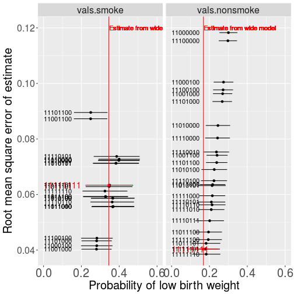

This vignette shows how to use the `fic` package through 2 or 3 examples. 

Work in progress!

## Example: covariate selection in logistic regression 


This example is used by @claeskens:hjort:book (Example 6.1) to illustrate the focused information criterion.  The dataset was originally presented by @hosmer:lemeshow:firstedition. Data are taken from $n=189$ women with newborn babies, and the binary outcome is whether the baby is born with a weight less than 2500g.   We build a logistic regression model to predict the outcome, but are uncertain about what covariates should be included. 

The data are provided as an object `birthwt` in the `fic` package.  This is the same as `birthwt` in `MASS` @venables:ripley with the addition of a few extra columns defining interactions and transformations as in @claeskens:hjort:book. 

The following covariates are always included (coefficient vector $\btheta$)

* $x_1$ Weight of mother in kg, `lwtkg`

The following covariates will be selected from (coefficient vector $\bgamma$)

* $z_1$ age, in years, `age`

* $z_2$ indicator for smoking, `smoke`

* $z_3$ history of hypertension, `ht`

* $z_4$ uterine irritability, `ui`

* interaction $z_5 = z_1 z_2$ between smoking and age, `smokeage`

* interaction $z_6 = z_2 z_4$ between smoking and uterine irritability, `smokeui`


## Defining the wide model and the focus function

Firstly the wide model is defined and fitted.  


```r
library(fic)
wide.glm <- glm(low ~ lwtkg + age + smoke + ht + ui + smokeage + smokeui, data=birthwt, family=binomial)
```

The *focus function* is then defined.  This should be an R function, mapping the parameters `par` of the wide model to the quantity of interest.   The focus can optionally have an second argument.  If supplied, this must be called `X`, and can be used to supply covariate values at which the focus function should be evaluated.  Here we take the probability of low birth weight as the focus, for two covariate categories: 
 
1. smokers with average or typical values of the other covariates.  These values are given in the order supplied when specifying the model (for smokers: intercept, `lwtkg`=58.24, `age`=22.95, `smoke`=1, `ht`=0, `ui`=0, `smokeage`=22.95, `smokeui`=0).

2. non-smokers with average values of the other covariates


```r
focus <- function(par, X)plogis(X %*% par)
vals.smoke <-    c(1, 58.24, 22.95, 1, 0, 0, 22.95, 0)
vals.nonsmoke <- c(1, 59.50, 23.43, 0, 0, 0, 0, 0)
X <- rbind(vals.smoke, vals.nonsmoke)
```

We can illustrate these functions by calculating the probability of low birth weight, given the parameters of the fitted wide model, for each group.  Note this is about twice as high for smokers. 

```r
focus(coef(wide.glm), X=X)
```

```
##                    [,1]
## vals.smoke    0.3452157
## vals.nonsmoke 0.1682614
```


### Comparing a small number of submodels 

The `fic` function can then be used to calculate the mean square error of the focus for one or more given submodels.  For example, compare two models, both including maternal weight, one including age and smoking, but the other including age, smoking and hypertension. 


```r
mod1.glm <- glm(low ~ lwtkg + age + smoke, data=birthwt, family=binomial)
mod2.glm <- glm(low ~ lwtkg + age + smoke + ht, data=birthwt, family=binomial)
```

We supply the following arguments to the `fic` function.

* `wide` the fitted wide model.  All the model fit statistics are computed using the estimates and covariance matrix from this model.   `fic` will automatically recognise that this is a GLM fitted by the `glm` function in R, and extract the relevant information. 

* `inds` indicators for which parameters are included in the submodel, that is, which elements of $(\btheta,\bgamma)$ are fixed to $\bgamma_0$.  This should have number of rows equal to the number of submodels to be assessed, and number of columns equal to $dim(\btheta) + dim(\bgamma)$, the total number of parameters in the wide model.  It contains 1s in the positions where the parameter is included in the submodel, and 0s in positions where the parameter is excluded.  This should always be 1 in the positions defining the narrow model, as specified in `inds0` below.
If just one submodel is to be assessed, `inds` can also be supplied as a vector of length $dim(\btheta) + dim(\bgamma)$. 

* `inds0` vector of indicators for which parameters are included in the narrow model, in the same format as `inds`.

* `focus` the focus function. 

* `sub` a list of the fitted submodels to be assessed.  This is optional, and is only needed so that the results from `fic` can include the estimate of the focus under the submodels.  If just one submodel is to be assessed, this can be a single fitted model object instead of a list. 

The main `fic` function then returns an object containing the model fit statistics and the estimate of the focus quantity for each model. 


```r
inds <- rbind(mod1 = c(1,1,1,1,0,0,0,0),
              mod2 = c(1,1,1,1,1,0,0,0))
inds0 <- c(1,1,0,0,0,0,0,0)
sub <- list(mod1.glm, mod2.glm)
fic1 <- fic(wide=wide.glm, inds=inds, inds0=inds0, focus=focus, X=X, sub=sub)
fic1
```

```
##            vals mods       FIC       rmse   rmse.adj       bias bias.adj
## 1    vals.smoke mod1 1.1866027 0.07228831 0.05583219 0.05483252 0.000000
## 2 vals.nonsmoke mod1 1.3051438 0.08035632 1.82775754 0.07649907 1.827452
## 3    vals.smoke mod2 0.7832862 0.05560261 0.05719836 0.02374486 0.000000
## 4 vals.nonsmoke mod2 0.7553928 0.05956847 1.48654135 0.05253422 1.486135
##           se     focus
## 1 0.05583219 0.3978356
## 2 0.03341509 0.2427444
## 3 0.05719836 0.3658331
## 4 0.03476108 0.2152807
```


TODO explain the different components of `res` 


### Calling `fic` for an unfamiliar class of models 

Above, the `fic` function recognised the fitted model objects as GLMs, that is, objects of class `"glm"` returned by the `glm()` function in base R.
But the package can be used to calculate focused model comparison statistics for any class of models, not just the special classes it recognises.

To do this, it needs to know three pieces of information about the fitted model objects.   TODO illustrate `fns` argument 


### Testing an automatically-defined set of models 

The following code creates a matrix of indicators for all possible covariate selections between the narrow and wide models.    

```r
combs <- expand.grid(intercept=1, lwtkg=1, age=c(0,1), smoke=c(0,1), ht=c(0,1), ui=c(0,1), smokeage=c(0,1), smokeui=c(0,1))
```

We can supply this to fic to run fic for all combinations of included / excluded parameters
The following function calculates the focused model comparison statistics for all of these models, for a focus defined by the probability of low birth weight at covariate values defined by `X`.


```r
ficres <- fic(wide=wide.glm, inds=combs, inds0=inds0, focus=focus, X=X)
```

```
## Warning in sqrt(mse.S/n): NaNs produced

## Warning in sqrt(mse.S/n): NaNs produced
```

However some of these models may not make sense. 
Models with interactions but not both corresponding main effects are then excluded.  
Two alternative sets of names for the models are also created 


```r
combs <- with(combs,
              combs[!((smoke==0 & smokeage==1) |
                      (smoke==0 & smokeui==1) |
                      (age==0 & smokeage==1) |
                      (ui==0 & smokeui==1)),])
rownames(combs) <- apply(combs, 1, paste, collapse="")
namesfull <- apply(combs, 1, function(x)paste(colnames(combs)[x==1], collapse=","))
ficres <- fic(wide=wide.glm, inds=combs, inds0=inds0, focus=focus, X=X)
```

```
## Warning in sqrt(mse.S/n): NaNs produced

## Warning in sqrt(mse.S/n): NaNs produced
```

We can actually fit the submodels in a loop by forming a covariate matrix, and subsetting its columns at each iteration.   The list of fitted models can then be passed to the fic function so that so that the focus estimate is displayed alongside the fic results. 


```r
Xobs <- with(birthwt, cbind(intercpt, lwtkg))
Zobs <- with(birthwt, cbind(age, smoke, ht, ui, smokeage, smokeui))
nmod <- nrow(combs)
sub <- vector(nmod, mode="list")
for (i in 1:nmod){
  XZi <- cbind(Xobs, Zobs)[,which(combs[i,]==1)]
  sub[[i]] <- glm(low ~ XZi - 1, data=birthwt, family=binomial)
}
ficres <- fic(wide=wide.glm, inds=combs, inds0=inds0, focus=focus, X=X, sub=sub)
ficres
```

```
##             vals     mods        FIC       rmse   rmse.adj          bias
## 1     vals.smoke 11000000 0.04460724        NaN 0.04144144 -1.536285e-02
## 2  vals.nonsmoke 11000000 2.72951487 0.11829410 0.12260399  1.201744e-01
## 3     vals.smoke 11100000 0.06364625        NaN 0.04691241 -1.775825e-02
## 4  vals.nonsmoke 11100000 2.60030823 0.11536837 0.15091824  1.171501e-01
## 5     vals.smoke 11010000 1.18798058 0.07233872 0.05583214  5.489907e-02
## 6  vals.nonsmoke 11010000 1.44581082 0.08486111 1.90959946  8.164556e-02
## 7     vals.smoke 11110000 1.18660266 0.07228831 0.05583219  5.483252e-02
## 8  vals.nonsmoke 11110000 1.30514383 0.08035632 1.82775754  7.649907e-02
## 9     vals.smoke 11001000 0.50619636 0.04031832 0.60100559 -4.819821e-02
## 10 vals.nonsmoke 11001000 1.83802532 0.09631520 0.63564240  9.777360e-02
## 11    vals.smoke 11101000 0.55366190 0.04332098 0.61136021 -5.053138e-02
## 12 vals.nonsmoke 11101000 1.73643758 0.09348324 0.62219026  9.480819e-02
## 13    vals.smoke 11011000 0.78370946 0.05562275 0.05719833  2.379211e-02
## 14 vals.nonsmoke 11011000 0.84862944 0.06357451 1.58274807  5.764010e-02
## 15    vals.smoke 11111000 0.78328615 0.05560261 0.05719836  2.374486e-02
## 16 vals.nonsmoke 11111000 0.75539281 0.05956847 1.48654135  5.253422e-02
## 17    vals.smoke 11000100 0.52528275 0.04155181 0.46120676 -4.622510e-02
## 18 vals.nonsmoke 11000100 1.99263723 0.10047223 0.52205204  1.015313e-01
## 19    vals.smoke 11100100 0.56944732 0.04427446 0.47005641 -4.848430e-02
## 20 vals.nonsmoke 11100100 1.88857590 0.09769381 0.51022588  9.861644e-02
## 21    vals.smoke 11010100 0.84972529 0.05867862 0.05868382  2.389711e-02
## 22 vals.nonsmoke 11010100 0.98472464 0.06900579 1.70336481  6.320927e-02
## 23    vals.smoke 11110100 0.85021071 0.05870050 0.05868385  2.395062e-02
## 24 vals.nonsmoke 11110100 0.88281392 0.06498145 1.61106786  5.821091e-02
## 25    vals.smoke 11001100 1.63870169 0.08727920 1.09900791 -8.694463e-02
## 26 vals.nonsmoke 11001100 1.12345086 0.07413366 0.74804350  7.414747e-02
## 27    vals.smoke 11101100 1.71469276 0.08955293 1.09590787 -8.912099e-02
## 28 vals.nonsmoke 11101100 1.05152613 0.07152095 0.72326135  7.131061e-02
## 29    vals.smoke 11011100 0.86292712 0.05927083 1.46036160 -1.501258e-02
## 30 vals.nonsmoke 11011100 0.49330872 0.04649424 1.19321723  3.409888e-02
## 31    vals.smoke 11111100 0.86245096 0.05924957 1.44404729 -1.492777e-02
## 32 vals.nonsmoke 11111100 0.44698413 0.04377911 1.06418088  2.916478e-02
## 33    vals.smoke 11110010 1.19860028 0.07272606 0.10022809  5.540124e-02
## 34 vals.nonsmoke 11110010 1.15695317 0.07531972 0.08475358  7.059054e-02
## 35    vals.smoke 11111010 0.78530400 0.05569853 0.07287489  2.396653e-02
## 36 vals.nonsmoke 11111010 0.64758290 0.05457087 0.06597821  4.578227e-02
## 37    vals.smoke 11110110 0.81972263 0.05731000 0.05877221  1.978793e-02
## 38 vals.nonsmoke 11110110 0.68383453 0.05630087 0.04591879  4.664054e-02
## 39    vals.smoke 11111110 0.90796606 0.06124812 0.06185847 -2.076243e-02
## 40 vals.nonsmoke 11111110 0.36525726 0.03852523 0.03793042  1.532534e-02
## 41    vals.smoke 11010101 1.15909664 0.07127458 0.06174436  3.835107e-02
## 42 vals.nonsmoke 11010101 0.84037863 0.06323024 1.44670722  5.436769e-02
## 43    vals.smoke 11110101 1.22603205 0.07371717 0.06186774  4.236107e-02
## 44 vals.nonsmoke 11110101 0.70519134 0.05729561 1.35945379  4.586232e-02
## 45    vals.smoke 11011101 0.94592097 0.06286614 0.53199552  2.463359e-03
## 46 vals.nonsmoke 11011101 0.42474692 0.04241407 0.75824650  2.195360e-02
## 47    vals.smoke 11111101 0.95788867 0.06336776 0.06320413  6.435849e-03
## 48 vals.nonsmoke 11111101 0.39245705 0.04034982 0.42799320  1.299488e-02
## 49    vals.smoke 11110111 1.15826972 0.07124388 0.07347445  3.750065e-02
## 50 vals.nonsmoke 11110111 0.56779481 0.05055513 0.04969619  3.507911e-02
## 51    vals.smoke 11111111 0.95788859 0.06336776 0.06336776 -1.122520e-15
## 52 vals.nonsmoke 11111111 0.39245672 0.04034980 0.04034980  6.299034e-16
##       bias.adj         se     focus
## 1  -0.01536285 0.03848864 0.3085883
## 2   0.12017436 0.02428705 0.3003191
## 3  -0.02662142 0.03862738 0.3090238
## 4   0.14889392 0.02463563 0.2974912
## 5   0.00000000 0.05583214 0.3983999
## 6   1.90931620 0.03289010 0.2449329
## 7   0.00000000 0.05583219 0.3978356
## 8   1.82745207 0.03341509 0.2427444
## 9  -0.59962383 0.04073065 0.2800391
## 10  0.63511316 0.02593305 0.2697125
## 11 -0.60999338 0.04085804 0.2807398
## 12  0.62163608 0.02625479 0.2676185
## 13  0.00000000 0.05719833 0.3659419
## 14  1.58237724 0.03425962 0.2169201
## 15  0.00000000 0.05719836 0.3658331
## 16  1.48613487 0.03476108 0.2152807
## 17 -0.45924835 0.04245742 0.2813887
## 18  0.52137438 0.02659115 0.2745058
## 19 -0.46812449 0.04257331 0.2820663
## 20  0.50951639 0.02689781 0.2721159
## 21  0.00000000 0.05868382 0.3657425
## 22  1.70301334 0.03460125 0.2254070
## 23  0.00000000 0.05868385 0.3657021
## 24  1.61068574 0.03508692 0.2238281
## 25 -1.09808083 0.04513182 0.2489039
## 26  0.74749986 0.02851366 0.2402214
## 27 -1.09497385 0.04523632 0.2496031
## 28  0.72268797 0.02879365 0.2383383
## 29 -1.45911084 0.06042816 0.3276631
## 30  1.19266668 0.03624284 0.1951220
## 31 -1.44278238 0.06042825 0.3278315
## 32  1.06354778 0.03670240 0.1939081
## 33  0.08323487 0.05583572 0.3996947
## 34  0.07761507 0.03404514 0.2370682
## 35  0.04515580 0.05719880 0.3679332
## 36  0.05566048 0.03542647 0.2095404
## 37  0.00000000 0.05877221 0.3630316
## 38  0.02823577 0.03621156 0.2139627
## 39 -0.01259394 0.06056289 0.3245239
## 40  0.00000000 0.03793042 0.1831733
## 41  0.00000000 0.06174436 0.3833061
## 42  1.44624569 0.03653987 0.2143576
## 43  0.00000000 0.06186774 0.3865491
## 44  1.35893739 0.03746692 0.2101583
## 45  0.52824091 0.06309341 0.3465058
## 46  0.75727485 0.03837381 0.1823570
## 47  0.00000000 0.06320413 0.3496527
## 48  0.42618600 0.03928961 0.1784131
## 49  0.03944696 0.06198735 0.3824120
## 50  0.03151221 0.03842774 0.2012653
## 51  0.00000000 0.06336776 0.3452157
## 52  0.00000000 0.04034980 0.1682614
```


TODO Explain why there are NaNs.

Then show how to plot them. TODO condition on ggplot2.  TODO annotate/simplify.


```r
library(ggplot2)
```


```r
ress <- within(ficres,{
  l95 = focus - qnorm(0.975)*se
  u95 = focus + qnorm(0.975)*se
})
ress <- subset(ress, !is.nan(ress$rmse))
ress <- ress[order(ress$rmse, decreasing=TRUE),]
ress_wide <- ress[ress$mods=="11111111",]
wide_est <- focus(coef(wide.glm), X)
ress$wide_est <- wide_est[match(ress$vals, rownames(wide_est))]

ps <- ggplot(ress[ress$mods!="11111111",],
         aes(x=focus, y=rmse)) +
  facet_grid(.~vals) + 
  xlim(0, 0.6) + 
  xlab("Probability of low birth weight") +
  ylab("Root mean square error of estimate") + 
  geom_point() +
  geom_segment(aes(x=l95, xend=u95, yend=rmse)) +
  geom_point(data=ress_wide, col="red") +
  geom_segment(aes(x=l95, xend=u95, yend=rmse), data=ress_wide, col="red") +
  geom_text(aes(x=0, label="11111111", hjust=0), data=ress_wide, col="red", size=5) +
  geom_text(aes(x=0, label=mods, hjust=0)) +
  geom_vline(aes(xintercept = wide_est), col="red") +
  theme(text = element_text(size=20),
        axis.text.x = element_text(size=20)) +
  geom_text(aes(x=wide_est, y= 0.12, label="Estimate from wide model", hjust=0), col="red") 
ps
```




### Average FIC over a range of focuses 

TODO 


### Other model classes 

Survival (see separate survival vignette for now)

Multi-state

???

